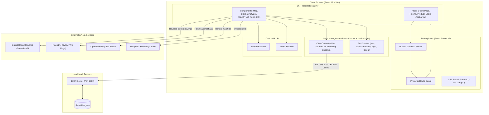

# 🌍 WorldWise — Keep Track of Your Adventures

[](https://reactjs.org/)
[](https://vitejs.dev/)
[](https://reactrouter.com/)
[](https://leafletjs.com/)
[](https://github.com/typicode/json-server)
[](https://opensource.org/licenses/MIT)

> **WorldWise** is a full-featured travel tracking web application that lets you log every city you have ever visited across the globe. Click anywhere on an interactive world map, automatically reverse-geocode your location, write personal travel notes, and preserve your travel memories in an intuitive, beautifully designed interface.

---

## 🌟 Overview

WorldWise solves a common problem for avid globetrotters: keeping track of cities, dates, and memories in a visual, map-centric interface.

By leveraging **Leaflet** with **OpenStreetMap**, the app provides seamless pan, zoom, and location-pinning capabilities. Combined with **BigDataCloud's Reverse Geocoding API**, users can click any coordinate on earth and immediately fetch the city, country, and national flag without manual entry.

---

## ✨ Key Features

- 🗺️ **Interactive World Map**: Powered by Leaflet and OpenStreetMap tiles with smooth zoom, pan, and custom marker popups.
- 📍 **Click-to-Add Location**: Tap any spot on the globe to open a pre-populated log form with automatic reverse-geocoding.
- 🌐 **Automatic Reverse Geocoding**: Instant lookup of city names, countries, and flag emojis via the BigDataCloud API.
- 📅 **Trip Logging & Notes**: Record exact visit dates using `react-datepicker` along with custom impressions and trip highlights.
- 🎯 **Browser Geolocation**: One-click "Use your position" feature that pinpoints and pans to your current physical coordinates.
- 🌆 **City & Country Aggregation**: Browse visited cities chronologically or view aggregated unique countries stamped with national flags.
- 🔗 **Deep-Linked Map Coordinates**: Synchronized URL query params (`?lat=...&lng=...`) allow direct linking and zooming to specific cities.
- 📖 **Wikipedia Integration**: Directly jump from any recorded city details view to its Wikipedia article.
- 🔐 **Protected Routing & Fake Auth**: Built-in authentication guard pattern ensuring app data is secured behind an authenticated session.
- ⚡ **Code Splitting & Lazy Loading**: Bundles are lazily loaded with `React.lazy` and `Suspense` for optimal performance.

---

## 🏗 System Architecture



---

## 🛠 Tech Stack

| Category              | Technology                      | Description                                                     |
| --------------------- | ------------------------------- | --------------------------------------------------------------- |
| **Core Framework**    | React 18.2                      | Functional components, hooks, custom hooks                      |
| **Bundler & Tooling** | Vite 4.4                        | Fast ESM development server and Rollup production builds        |
| **Routing**           | React Router 6.30               | Declarative client routing, nested routes, search params        |
| **Maps & GIS**        | Leaflet 1.9 & React-Leaflet 4.2 | Interactive mapping, markers, popups, and event listeners       |
| **Styling**           | CSS Modules                     | Scoped component styling with shared CSS design variables       |
| **Date Picker**       | react-datepicker 9.1            | Interactive calendar date selection                             |
| **State Management**  | Context API + `useReducer`      | Centralized action-based state without heavy external libraries |
| **Mock Backend**      | json-server 1.0                 | Full REST API server watching `data/cities.json`                |
| **External APIs**     | BigDataCloud API                | Client reverse geocoding API                                    |
| **Assets & Flags**    | FlagCDN & OpenStreetMap         | High-resolution national flags & OSM Hot tiles                  |

---

## 📁 Project Structure

```text
worldwise/
├── data/
│   └── cities.json
├── public/
│   ├── bg.jpg
│   ├── icon.png
│   ├── img-1.jpg / img-2.jpg
│   └── logo.png
├── src/
│   ├── assets/
│   ├── Contexts/
│   │   ├── CitiesContext.jsx
│   │   └── FakeAuthContext.jsx
│   ├── hooks/
│   │   ├── useGeolocation.js
│   │   └── useUrlPosition.js
│   ├── components/
│   │   ├── AppNav.jsx
│   │   ├── BackButton.jsx
│   │   ├── Button.jsx
│   │   ├── City.jsx
│   │   ├── CityItem.jsx
│   │   ├── CityList.jsx
│   │   ├── CountryItem.jsx
│   │   ├── CountryList.jsx
│   │   ├── Form.jsx
│   │   ├── Logo.jsx
│   │   ├── Map.jsx
│   │   ├── Message.jsx
│   │   ├── PageNav.jsx
│   │   ├── Sidebar.jsx
│   │   ├── Spinner.jsx
│   │   ├── SpinnerFullPage.jsx
│   │   └── User.jsx
│   ├── pages/
│   │   ├── AppLayout.jsx
│   │   ├── HomePage.jsx
│   │   ├── Login.jsx
│   │   ├── PageNotFound.jsx
│   │   ├── Pricing.jsx
│   │   ├── Product.jsx
│   │   └── ProtectedRoute.jsx
│   ├── App.jsx
│   ├── index.css
│   └── main.jsx
├── index.html
├── package.json
└── README.md
```

---

## 🚀 Getting Started

### Prerequisites

Make sure you have the following installed on your machine:

- [Node.js](https://nodejs.org/) (`v16.0.0` or higher recommended)
- `npm` (bundled with Node.js)

---

### Installation

1. **Clone the repository:**

   ```bash
   git clone https://github.com/FatmaEid06/WorldWise.git
   cd worldwise
   ```

2. **Install project dependencies:**
   ```bash
   npm install
   ```

---

### Running the Application

WorldWise uses two concurrently running processes: the **Vite dev server** and the **json-server mock backend**.

#### 1. Start the mock backend API (Port 9000):

```bash
npm run server
```

> This starts `json-server` watching `data/cities.json` on `http://localhost:9000`.

#### 2. In a separate terminal, start the frontend development server:

```bash
npm run dev
```

> Vite will start the frontend app (typically at `http://localhost:5173`). Open this URL in your browser!

---
